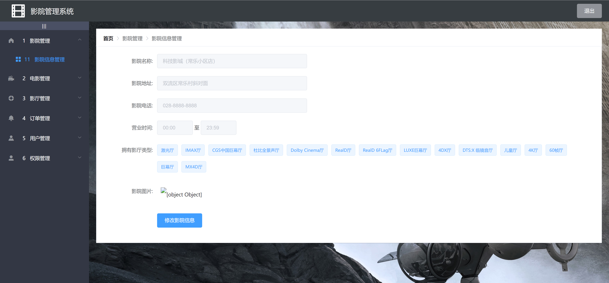

<h1 align="center">影院电影售票管理系统</h1>

## 简介
影院电影售票管理系统：角色分为管理员、用户；支持电影分类筛选、票务销售、座位选择、用户及权限管理和统计报表生成等功能，提高购票和管理流程效率。    --计算机毕业设计源码；毕设源码；java毕业设计源码

## 联系方式

<h3 align="center">获取完整代码与数据库文件 + 微信：bysj5151 QQ: 86050149 QQ群: 783742310</h3>

<h3 align="center">可帮忙远程部署 包运行成功！提供远程部署、修改代码、设计文档指导、代码讲解等服务！</h3>

## 功能介绍（完整见运行截图）
管理员：基本功能包括登录、注册、用户信息管理、影院信息管理、影厅管理、影片管理、订单管理和权限管理。管理员可添加、编辑或删除电影信息，管理用户权限，生成统计报表并支持影院业务流程的高效管理。  
用户：基本功能包括登录、注册和退出。用户可以通过系统浏览电影列表，查看详情，选择放映时间和座位进行购票，并完成在线支付。用户管理功能还允许查看和管理个人信息、订单历史，以及使用搜索和筛选选项查找电影或管理订单。

## 运行截图

本代码来源于网络,仅供学习参考使用!

